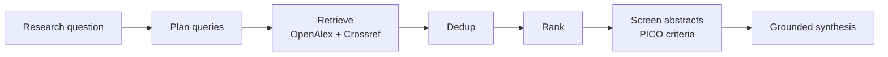

# NOETARCH

[](LICENSE)
[](#developing)
[](backend/pyproject.toml)
[](frontend/package.json)

**Evidence you can defend — a local-first AI research workspace.**

NOETARCH ("Chief of the realm of thought") turns a research question into a defensible
evidence trail: it plans searches, pulls papers from open scholarly sources, de-duplicates and
ranks them, screens each abstract against explicit criteria, and drafts a synthesis where every
claim is grounded in a paper you can open. It runs on your machine, keeps your API key in an
encrypted local vault, sends nothing to any telemetry backend, and records the provenance of
every step so you — not a black box — can stand behind the result.

---

## Quickstart

The whole flow is UI-driven — no terminal, no `curl`, no CLI once the app is up.

**Prerequisites**

- [Docker Desktop](https://www.docker.com/products/docker-desktop/) **running** (Compose v2).
- An Anthropic API key (BYOK) for real screening runs. No key? The app still starts — use
  demo mode (below) for a fully populated offline tour.

**Confirm Docker is actually live** (Desktop can be installed but not started):

```bash
docker info >/dev/null 2>&1 && echo "Docker is up" || echo "Start Docker Desktop first"
```

**Build and open**

```bash
git clone https://github.com/Koi725/NOETARCH.git
cd NOETARCH
./scripts/build.sh          # real/empty DB, external sources ON, health-gated
```

`build.sh` builds both images, starts the stack, and **waits** until the backend
(`/api/v1/health/ready`) and the frontend actually respond before printing its ready banner.
Ports bind to `127.0.0.1` only.

**Then, in the browser:**

1. Open **http://localhost:3000**. On first load the app checks for a provider key.
2. **Paste your API key** in the *Connect your API key* onboarding gate and continue. It is
   encrypted in a local vault — never written to logs, `.env`, or the browser. (A key already
   present? You skip straight in.)
3. Go to **Live run → Start a new run**, enter a research question (optionally a year range, max
   papers, and a budget cap), and press **Start run**.
4. **Read the result.** The run summary shows found / merged / unique / screened /
   include·exclude·uncertain / tokens / cost, then deep-links into **Evidence** and
   **Decisions** filtered to that run. Past runs live under **History**.

> **If the key gate reappears** after you thought you'd connected a key, just re-add it under
> **Models & Policy → Connect a key**. The gate is driven by the encrypted vault; re-entering
> the key re-seeds it and clears the gate.

**Stop / logs**

```bash
docker compose logs -f          # follow logs
docker compose down             # stop (add -v to also drop the DB volume)
```

### Other run modes

```bash
./scripts/build.sh --seed       # load the DEMO dataset (populated screens, no key needed)
./scripts/build.sh --fresh      # reset the DB volume first, then rebuild
make dev                        # local (non-container) dev — requires uv + Node
```

Demo mode (`--seed`) fills every screen from a bundled dataset and needs **no API key and no
network** — a safe way to explore the UI before you connect a key.

---

## Features

- **Provenance trail** — every fetched paper is frozen with its source and retrieval time; every
  screening decision and synthesis claim is traceable back to a specific record.
- **Human approval gates + audit** — model output is stored as *pending claims*, never
  auto-executed. Decisions are yours to approve, and each is written to an append-only audit log.
- **Budget guard** — set a per-run USD cap; the run halts cleanly the moment it's reached and the
  summary shows exactly where it stopped. You're never billed past the cap.
- **PICO criteria + grounded synthesis** — the run derives explicit inclusion/exclusion criteria
  and drafts findings whose citations are guaranteed to be in the included, frozen evidence set.
- **Multi-source + dedup** — retrieves from **OpenAlex** and **Crossref**, merges and
  de-duplicates by DOI, then ranks to a top-N candidate set.
- **Deterministic reproducibility** — a run is keyed by `run_id`; re-opening it reconstructs the
  exact frozen state from the database with zero new provider calls.
- **Security / local-first** — encrypted key vault, a single SSRF-guarded egress allowlist,
  loopback-only binding, and no telemetry.

## How it works



```
question → plan → retrieve (OpenAlex + Crossref) → dedup → rank → screen → synthesize
```

Each stage is budget-gated: if a run reaches its cap it degrades gracefully (e.g. skips the
model-driven steps) rather than overrunning your budget.

## Security

- **Encrypted key vault (BYOK)** — provider keys live only in a Fernet-encrypted local vault.
  They never enter `.env`, logs, fixtures, or any API response; reads return a masked
  `sk-…last4` only.
- **Single guarded egress allowlist** — all outbound traffic (OpenAlex, Crossref, Anthropic)
  flows through one client with a host allowlist and SSRF defenses. Nothing binds beyond
  `127.0.0.1`. Turn egress off entirely with `NOETARCH_EXTERNAL_SOURCES_ENABLED=false`.
- **Prompt-injection defense** — model output is treated as untrusted: it is stored as
  provenance-tagged pending claims and never executed; synthesis citations are validated against
  the frozen included set before display.
- **100% local, no telemetry** — the app makes no outbound call except the allowlisted research
  and model APIs you opt into. There is no analytics or phone-home.

See [`SECURITY.md`](SECURITY.md) and [`docs/security/THREAT_MODEL.md`](docs/security/THREAT_MODEL.md).

## Screenshots

> Placeholders — drop real captures in per [`docs/SCREENSHOTS.md`](docs/SCREENSHOTS.md).

| Run summary | Evidence provenance | Decisions | Synthesis |
| --- | --- | --- | --- |
| _(run-summary.png)_ | _(evidence-provenance.png)_ | _(decisions.png)_ | _(synthesis.png)_ |

## Configuration

Reference: [`backend/.env.example`](backend/.env.example) and
[`frontend/.env.example`](frontend/.env.example). The one-command paths pre-wire CORS and
`NEXT_PUBLIC_API_BASE`, so no manual env editing is needed for the default flow.

| Variable | Where | Default | Purpose |
| --- | --- | --- | --- |
| `NOETARCH_SEED_DEMO` | backend | `false` (build.sh) | `true` loads the demo dataset instead of an empty workspace. |
| `NOETARCH_EXTERNAL_SOURCES_ENABLED` | backend | `true` (build.sh) | Master switch for all outbound research egress. |
| `NOETARCH_LLM_PROVIDER` / `NOETARCH_LLM_MODEL` | backend | `anthropic` / `claude-haiku-4-5` | Default provider + model for runs (also selectable in **Models & Policy**). |
| `NOETARCH_EGRESS_CONTACT_EMAIL` | backend | empty | Contact for the polite OpenAlex User-Agent (not a secret). |
| `NOETARCH_SECRET_KEY` / `NOETARCH_SECRET_KEY_PATH` | backend | auto-generated file | Fernet master key for the vault. Leave empty to auto-generate at the path (0600). |
| `NOETARCH_CORS_ALLOW_ORIGINS` | backend | frontend origin (compose) | Explicit CORS allowlist; empty denies all cross-origin. |
| `NEXT_PUBLIC_API_BASE` | frontend | backend URL (compose) | Unset → the UI runs standalone on mock data. |

- **Model selection** — change `NOETARCH_LLM_MODEL`, or pick a model in the **Models & Policy**
  screen. The latest Claude models are recommended for screening quality.
- **Demo toggle** — `--seed` / `NOETARCH_SEED_DEMO=true` for the populated tour; the default is
  a clean, empty workspace ready for real runs.
- **Budget** — set a per-run cap in the **Live run** form; the budget guard enforces it.

## Tech stack

- **Backend** — Python 3.11+, FastAPI, SQLAlchemy 2 + Alembic (SQLite), Pydantic v2, httpx,
  `cryptography` (Fernet vault). Managed with `uv`.
- **Frontend** — Next.js 16 (App Router) + React 19, TypeScript, Tailwind CSS, lucide-react.
- **Quality gates** — ruff, mypy (strict), pytest; eslint, tsc, vitest, `next build`.
- **Runtime** — Docker Compose (loopback-only), one-command health-gated startup.

## Developing

Everything runs against the repo's own toolchain. See **[DEVELOPERS.md](DEVELOPERS.md)** for the
full setup, and run all quality gates with:

```bash
make gates
```

## Contributing

Contributions are welcome — start with **[CONTRIBUTING.md](CONTRIBUTING.md)** and
**[DEVELOPERS.md](DEVELOPERS.md)**. Governance is canonical in [`AGENTS.md`](AGENTS.md); material
architecture/security decisions are recorded under `coordination/DECISIONS.md`.

## License

[MIT](LICENSE) © Kousha ([@Koi725](https://github.com/Koi725)).
</content>
</invoke>
