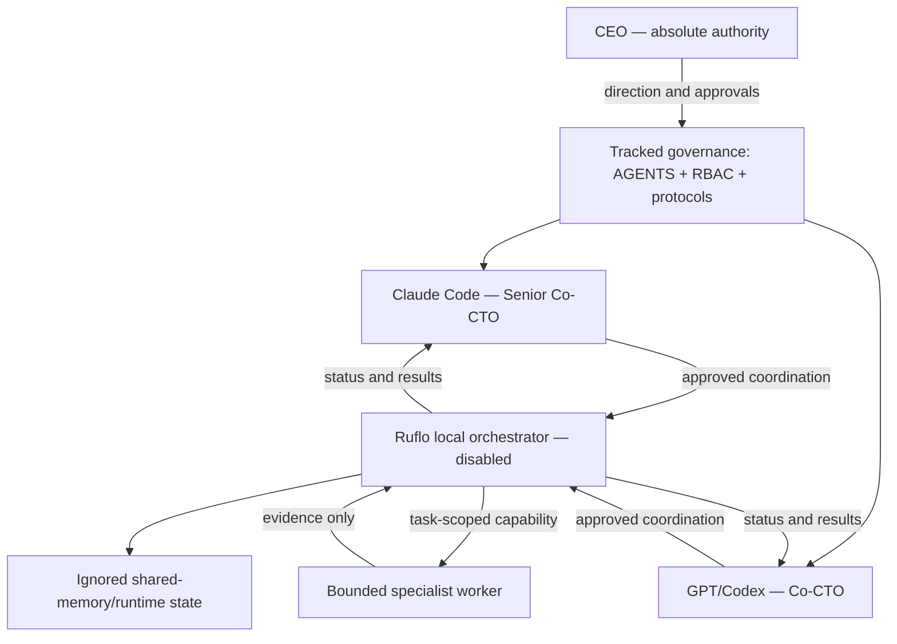

# NOETARCH Governance Architecture

## Current system

NOETARCH currently has no product runtime. Its implemented architecture is a tracked governance control plane plus planned, disabled local orchestration.

## Components

| Component | Responsibility | Authority boundary |
|---|---|---|
| CEO | Direction, approvals, risk acceptance, Git and release actions | Final authority |
| `AGENTS.md` and RBAC | Canonical rules and deny-by-default capability map | Changed only with CEO approval |
| Claude Code | Senior technical review and provisional tie-break | Cannot override CEO or perform Git mutations |
| GPT/Codex | Implementation, infrastructure, review, and validation | Cannot override CEO/tie-break or perform Git mutations |
| Ruflo | Future local routing, memory, status, bounded workers, audits | Infrastructure only; currently disabled |
| Shared memory | Non-secret cross-client coordination data | Untrusted input; ignored runtime state |
| Specialist worker | One scoped task with bounded tools and time | No standing authority or further delegation |
| Frontend/backend | Reserved directories only | Product phase not authorized |

## Data flow

The CEO supplies objectives and approvals. Agents resolve those instructions against tracked governance, then may ask an approved local Ruflo server to store non-secret coordination data or run a bounded worker. Ruflo returns status and evidence. A human or independent reviewer accepts or rejects consequential output; Ruflo cannot approve it.

## Evolution gate

The next architectural change is not product development. It is an approved, pinned, local-only Ruflo installation with a reviewed lockfile, restricted MCP tool set, ignored runtime storage, verified shutdown, and completed nonce round trip. Product components require a separate CEO decision.

